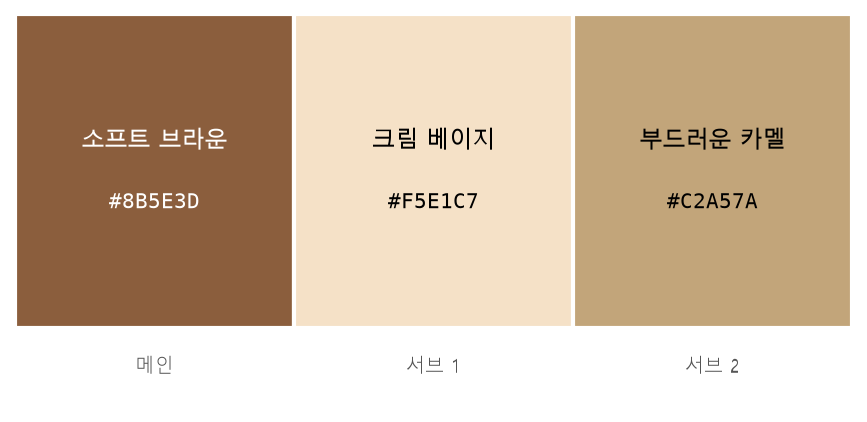

# 브랜드 아이덴티티 생성기

브랜드 브리프(업종·타깃·키워드)를 JSON으로 입력하면 **브랜드명·슬로건·스토리·컬러 팔레트·로고 시안**을
AI로 생성해 파일로 저장하는 CLI 프로그램입니다.

> [Project A] · 주제 **카페** · Python 3.10 이상

---

## 동작

```
[1] 브리프 입력 ─→ [2] 네이밍·슬로건·스토리 ─→ [3] 컬러 팔레트 ─→ [4] 로고 시안
                        (LLM)                    (LLM)          (이미지 생성)
                                                                      │
                                              [5] 결과 저장 & 에러 처리 통합
```

한 단계가 실패해도 멈추지 않습니다. 진행된 만큼을 저장하고 실패 원인을 `run_report.md`에 남깁니다.

---

## 실행

### 1. 설치

```bash
pip install -r requirements.txt
```

**외부 패키지 없이도 돌아갑니다.** LLM과 이미지 생성 API는 표준 라이브러리로 직접 호출합니다.
`requirements.txt`의 패키지는 있으면 결과가 나아지는 선택 항목입니다.

### 2. API 키 등록

`.env.example`을 `.env`로 복사한 뒤 키를 채웁니다.

```
OPENAI_API_KEY=본인의_API_키
GEMINI_API_KEY=본인의_API_키
```

**둘 중 하나만 있으면 됩니다.** OpenAI 키가 있으면 그것을, 없으면 Gemini를 씁니다.
연결 확인:

```bash
python test_api.py
```

키가 없어도 예시 값으로 대체되며 파이프라인은 중단되지 않습니다.

### 3. 실행

```bash
python main.py
```

```
🎨 브랜드 아이덴티티 생성기

브리프 JSON 경로를 입력하세요: samples/brief.json
   📋 카페 · 20~30대 직장인, 일상 속 여유를 찾는 사람
      키워드: 여유, 따뜻함, 일상의 쉼표, 감성

출력 폴더 경로를 입력하세요 (엔터 시 ./output):

  ✅ [1] 브리프
  ✅ [2] 네이밍·슬로건·스토리
  ✅ [3] 컬러 팔레트
  ✅ [4] 로고 시안

✅ 완료 단계 4/4 · output
```

잘못된 경로나 형식이면 이유를 알려 주고 다시 묻습니다.

---

## 입력 — 브랜드 브리프

[`samples/brief.json`](samples/brief.json)

```json
{
  "industry": "카페",
  "target": "20~30대 직장인, 일상 속 여유를 찾는 사람",
  "keywords": ["여유", "따뜻함", "일상의 쉼표", "감성"],
  "tone": "따뜻하고 감성적이며 과하지 않게 세련된 분위기",
  "competitors": ["블루보틀", "스타벅스"],
  "notes": "한글과 영어로 모두 활용하기 쉬운 브랜드명을 원함"
}
```

| 구분 | 필드 |
| --- | --- |
| **필수** | `industry` `target` `keywords`(2개 이상) |
| 선택 | `tone` `competitors` `notes` — 기본값을 채워 다음 단계로 넘깁니다 |

파일 없음 · `.json` 아님 · JSON 문법 오류 · 필수 필드 누락 · 자료형 불일치를
각각 구분해서 안내합니다. JSON 문법 오류는 몇 번째 줄인지 알려 줍니다.

---

## 출력

| 파일 | 내용 |
| --- | --- |
| **`brand_result.md`** | **브랜드 아이덴티티 결과 문서** |
| `brand_result.json` | 텍스트 결과 전체 |
| **`color_palette.png`** | **컬러 팔레트 시각화** |
| **`logo_01.png` `logo_02.png`** | **로고 시안** |
| `logo_prompts.md` | 로고 생성에 쓴 영어 프롬프트 |
| `run_report.md` | 단계별 성공·실패와 규격 위반 기록 |
| `brand_tokens.css` | 컬러 팔레트를 CSS 변수·Tailwind 설정으로 |

생성되는 내용

- 브랜드명 후보 3~5개 — 이름·**영문 표기**·읽는 법·의미
- 슬로건 3개, 브랜드 스토리 300자 내외(탄생 배경·철학·비전)
- 메인 컬러 1개 + 서브 컬러 2~3개, 각 색의 **본문 대비 명도비**
- 로고 시안 2장과 생성에 쓴 프롬프트

**보너스 과제로 다국어 네이밍 지원을 구현했습니다.**
후보마다 한글 이름과 영문 표기를 함께 만들고, `쉼표 (Comma, COM-ma)` 형태로 표기합니다.
영문 표기는 간판·도메인·SNS 계정에 그대로 쓸 수 있도록 알파벳 12자 안쪽으로 짓습니다.

### 실제 생성 결과

`output/` 폴더에 실행 결과를 그대로 담아 두었습니다.

**컬러 팔레트** — `output/color_palette.png`



**로고 시안** — `output/logo_01.png` · `output/logo_02.png`

| 시안 1 | 시안 2 |
| --- | --- |
|  |  |

텍스트 결과 전체는 [`output/brand_result.md`](output/brand_result.md) 와
[`output/brand_result.json`](output/brand_result.json) 에 있습니다.

---

## 구조

```
main.py                    진입점 — 대화형 입력과 [1] 브리프 검증
integrate.py               [5] 통합 실행
test_api.py                API 연결 테스트
brief.py             [1] load_brief() -> dict
naming.py            [2] generate_naming(brief) -> dict
palette.py           [3] generate_palette(brief, naming) -> dict
logo.py              [4] generate_logos(brief, naming, palette) -> list
brand_result/
  runner.py                단계 호출과 예외 격리
  validate.py              데이터 계약 검증
  store.py                 파일 저장 · 명도 대비 계산
  report.py                결과 문서 생성
  palette_png.py           컬러 팔레트 PNG 시각화
  logo_prompt.py           로고용 영어 프롬프트 생성
```

각 단계는 **파일 하나 · 함수 하나**로 분리되어 있습니다.
넘기는 형식만 지키면 내부 구현은 자유입니다.

---

## 테스트

```bash
python -m pytest -q
```

**112개.** 전부 실패 상황을 검증합니다 — 단계 파일이 없을 때, 코드가 예외를 던질 때,
규격이 어긋날 때, 저장이 불가능할 때, 입력이 잘못됐을 때.

---

## 문서

| 문서 | 내용 |
| --- | --- |
| [`docs/데이터-계약.md`](docs/데이터-계약.md) | 단계 간 입출력 규격 |
| [`docs/명세-점검표.md`](docs/명세-점검표.md) | 명세 요구사항과 구현 대조표 |
